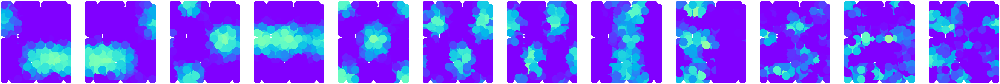
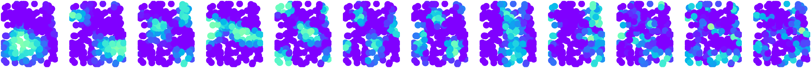

# Cohomological Decoding in the Visual Cortex

This toolkit provides a collection of Python functions for topological data analysis and visualization, particularly tailored for analyzing high-dimensional data in neural data. It includes functions for cohomological parameterization, plotting data with various dimension reduction techniques, displaying grating stimuli responses, and more.

## Overview

When attempting to decode neural data one may not always have access to the relavent stimuli values, or even know which stimuli the neurons may respond to. Therefore, in contrast to most traditional neural decoding methods, we may want to find a decoding based solely on the shape of the population activity, without making use of the stimuli labels. Here we apply a topological data analysis method described in:

https://arxiv.org/abs/1711.07205

and extend it to work on neural data in the primary visual cortex, where we may find more complicated topologies such as a Klein bottle. An example is provided where simulated neural activities in response to grating with varying phases and orientations are decoded.

## Contents

- **source:** This folder contains source code and utilities used for analyzing data.
- **example.ipynb:** This file contains an example of decoding simulated neural activities of simple cells in response to grating images. 
- **environment.yaml:** This file lists the required packages and dependencies needed.

## Usage

1. Ensure you have Python 3.10 or higher installed.
2. Set up the environment using the provided `environment.yaml` file.

```bash
    conda env create -f environment.yaml
    conda activate top_vision
```
3. Run the "example.ipynb" script in the main folder.

## Example
In "example.ipynb" the 2d receptive fields of simulated neurons responding to gratings with varying phases and orientations are reconstructed using only the neural activations, using no reference to the stimuli labels as is typical in decoding methods.

External receptive fields with respect to the used stimuli parameters:

Internal receptive fields computed from the topology:

